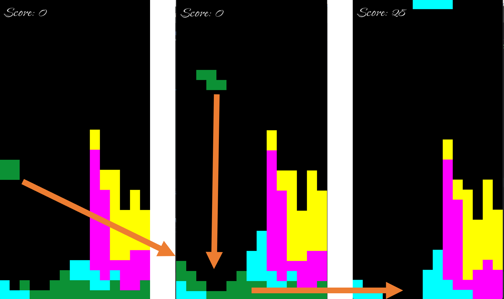

# JokerTetris ——重力版俄罗斯方块

## 项目介绍

***此项目为本人一门公选课的大作业***

**JokerTetris** 是一款基于经典俄罗斯方块游戏的重力版变体。他的灵感来源于Sandtrix（堆沙版）。与传统的俄罗斯方块不同，本项目中的方块到达底部后会分解为几个小正方块并根据一定的规则自由下落，并且能够根据颜色和位置进行消除。游戏旨在为玩家提供一种新的、充满挑战的游戏体验。

详细的玩法演示视频可以在附件中找到并查看！



## 项目架构

项目架构如下：

```bash
JokerTetris/
├── requirements.txt   # 项目的依赖文件
├── README.md          # 项目说明文件
├── 玩法演示视频.mp4     # 玩法演示视频
├── main.py            # 游戏主程序入口
├── src/               # 源代码目录
│   ├── game.py        # 游戏逻辑
│   ├── tetrimino.py   # 方块逻辑
│   └── grid.py        # 网格逻辑
└── assets/            # 游戏资源
    └── font.ttf       # 字体文件
```

# JokerTetris —— 重力版俄罗斯方块

## 项目介绍

**JokerTetris** 是一款基于经典俄罗斯方块游戏的重力版变体。与传统的俄罗斯方块不同，本项目中的方块下落的速度更快，并且方块到达底部后会变成沙粒，这些沙粒会根据一定的规则自由下落，并且能够根据颜色和位置进行消除。游戏旨在为玩家提供一种新的、充满挑战的游戏体验。

## 项目架构

项目结构如下：

```
JokerTetris/
├── requirements.txt   # 项目的依赖文件
├── README.md          # 项目说明文件
├── main.py            # 游戏主程序入口
├── src/               # 源代码目录
│   ├── game.py        # 游戏逻辑
│   ├── tetrimino.py   # 方块逻辑
│   └── grid.py        # 网格管理
└── assets/            # 游戏资源
    └── font.ttf       # 字体文件
```

### 目录说明

- **requirements.txt**：包含项目运行所需的Python库及其版本。可以通过运行 `pip install -r requirements.txt` 来安装所有依赖。

- **README.md**：项目的说明文档，包含项目介绍、安装方法、使用方法等。

- **main.py**：游戏的主程序入口文件，负责初始化 pygame，加载游戏窗口，并调用游戏主循环。

- src/

  源代码目录，包含游戏逻辑、方块（Tetrimino）逻辑以及网格（Grid）管理代码。详情可以点击目录看源码。

  - **game.py**：包含游戏核心逻辑，如处理玩家输入、更新游戏状态等。
  - **tetrimino.py**：定义方块（Tetrimino）的形状、颜色、旋转及移动等功能。
  - **grid.py**：定义网格（Grid）的相关逻辑，如方块下落、沙粒自由下落、沙粒消除等。

- **assets/**：存放游戏资源的文件夹，如字体文件、图片等。

## 安装与运行

### 1. 安装依赖

首先，你需要安装游戏运行所需的依赖库。可以使用以下命令来安装：

```bash
pip install -r requirements.txt
```

### 2. 运行游戏

安装完成后，你可以通过运行 `main.py` 来启动游戏：

```bash
python main.py
```

游戏窗口会打开，并进入游戏界面。

## 游戏玩法

### 控制方法

- **左右箭头**：控制当前方块向左或向右移动。
- **下箭头**：控制当前方块向下加速下落。
- **上箭头**：旋转当前方块。

### 游戏目标

- 游戏的目标是尽量消除小正方块，并防止小正方块堆积到屏幕的顶部。一旦小正方块堆积到顶部，游戏结束。
- 方块下落后会变成小正方块，并根据规则自由下落，同色相连的小正方块在连接左右两侧后会被消除。

## 代码结构与功能说明

### `main.py`

`main.py` 是游戏的主程序入口。它负责初始化 pygame、设置游戏窗口、创建游戏对象并启动游戏主循环。

```python
import pygame
from src.game import SandtrisGame

def main():
    pygame.init()

    screen = pygame.display.set_mode((360, 720))
    pygame.display.set_caption("Sandtris")

    clock = pygame.time.Clock()

    game = SandtrisGame(screen)

    # 主循环
    running = True
    while running:
        for event in pygame.event.get():
            if event.type == pygame.QUIT:  # 退出
                running = False
                pygame.quit()
            elif event.type == pygame.KEYDOWN:
                game.handle_input(event.key)

        running = game.update()

        game.draw()
        pygame.display.flip()

        clock.tick(30)

    pygame.quit()


if __name__ == "__main__":
    main()
```

### `tetrimino.py`

`Tetrimino` 类定义了方块的形状、颜色以及它们的旋转、移动等操作。方块的形状使用字典来定义，每种形状对应着一个位置坐标列表。每个方块也有一个随机的颜色。

```python
import random
import pygame

class Tetrimino:
    SHAPES = {
        "I": [(0, 0), (1, 0), (2, 0), (3, 0)],
        "O": [(0, 0), (1, 0), (0, 1), (1, 1)],
        "T": [(1, 0), (0, 1), (1, 1), (2, 1)],
        "S": [(1, 0), (2, 0), (0, 1), (1, 1)],
        "Z": [(0, 0), (1, 0), (1, 1), (2, 1)],
        "L": [(0, 0), (0, 1), (0, 2), (1, 2)],
        "J": [(1, 0), (1, 1), (1, 2), (0, 2)],
    }

    COLORS = [
        (0, 255, 255),  # 天蓝色
        (255, 255, 0),  # 黄色
        (12, 145, 53),  # 绿色
        (255, 0, 255),  # 紫色
    ]

    def __init__(self, grid):
        """
        初始化方块
        """
        self.grid = grid
        self.shape = random.choice(list(self.SHAPES.keys()))
        self.blocks = [(x + 6, y) for x, y in self.SHAPES[self.shape]]
        self.color = random.choice(self.COLORS)

    def move(self, dx, dy):
        """
        移动方块
        """
        if self.can_move(dx, dy):
            self.blocks = [(x + dx, y + dy) for x, y in self.blocks]
            return True
        return False

    def rotate(self):
        """
        旋转方块
        """
        pivot = self.blocks[0]  # 选择第一个方块作为旋转枢轴
        rotated = []
        for x, y in self.blocks:
            rotated.append((pivot[0] - y + pivot[1], pivot[1] + x - pivot[0]))  # 计算旋转后的坐标

        # 检查旋转后的位置是否超出边界
        if all(0 <= nx < self.grid.cols and 0 <= ny < self.grid.rows and self.grid.grid[ny][nx][0] == 0 for nx, ny in
               rotated):
            self.blocks = rotated

    def can_move(self, dx, dy):
        """
        检查是否可以移动
        """
        for x, y in self.blocks:
            nx, ny = x + dx, y + dy
            if nx < 0 or nx >= self.grid.cols or ny >= self.grid.rows or self.grid.grid[ny][nx][0] == 1:
                return False
        return True

    def draw(self, screen):
        """
        绘制当前方块
        """
        for x, y in self.blocks:
            pygame.draw.rect(
                screen,
                self.color,
                pygame.Rect(x * self.grid.cell_size, y * self.grid.cell_size, self.grid.cell_size, self.grid.cell_size),
            )
```

### `game.py`

`SandtrisGame` 类处理游戏的主要逻辑，如处理用户输入、更新游戏状态、检查游戏是否结束等。

```python
import pygame
from src.grid import Grid
from src.tetrimino import Tetrimino

class SandtrisGame:
    def __init__(self, screen):
        """
        初始化游戏对象
        """
        self.screen = screen  # 游戏窗口
        self.grid = Grid(15, 30, 24)  # 网格
        self.current_tetrimino = Tetrimino(self.grid)  # 当前操作的方块


        self.font = pygame.font.Font("assets/font.ttf", 40)

        # 控制方块下落的计时器
        self.drop_timer = 0
        self.drop_interval = 350  # 每 500ms 下落一次


    def handle_input(self, key):
        """
        处理用户输入
        """
        keys = pygame.key.get_pressed()

        if keys[pygame.K_LEFT]:
            self.current_tetrimino.move(-3, 0)

        elif keys[pygame.K_RIGHT]:
            self.current_tetrimino.move(1, 0)

        elif keys[pygame.K_DOWN]:
            self.current_tetrimino.move(0, 1)

        elif keys[pygame.K_UP]:
            self.current_tetrimino.rotate()

    def update(self):
        """
        更新游戏逻辑
        """
        current_time = pygame.time.get_ticks()

        if current_time - self.drop_timer >= self.drop_interval:
            if not self.current_tetrimino.move(0, 1):  # 如果不能下落
                self.grid.add_tetrimino_to_sand(self.current_tetrimino)  # 将方块分解为沙粒
                self.grid.collapse_sand(current_time)  # 沙粒自由下落
                self.grid.clear_connected_sand()  # 检查并清除符合规则的沙粒
                self.current_tetrimino = Tetrimino(self.grid)  # 生成新的方块

                if self.grid.is_game_over():
                    self.show_game_over()
                    return False

            self.drop_timer = current_time

        self.grid.collapse_sand(current_time)

        return True

    def show_game_over(self):
        """
        显示游戏结束画面
        """
        self.screen.fill((0, 0, 0))
        game_over_text = self.font.render("GAME OVER", True, (255, 0, 0))
        self.screen.blit(game_over_text, (70, 360))
        pygame.display.flip()
        pygame.time.wait(3000)  # 显示 3 秒

    def draw(self):
        """
        绘制游戏画面
        """
        self.screen.fill((0, 0, 0))
        self.grid.draw(self.screen)
        self.current_tetrimino.draw(self.screen)

        score_text = self.font.render(f"Score: {self.grid.score}", True, (255, 255, 255))
        self.screen.blit(score_text, (10, 10))
```

### grid.py

管理游戏的网格，处理方块下落、沙粒自由下落及消除等功能。

```python
import pygame

class Grid:
    def __init__(self, cols, rows, cell_size):
        """
        初始化游戏网格
        """
        self.score = 0  # 游戏得分
        self.cols = cols  # 网格列数
        self.rows = rows  # 网格行数
        self.cell_size = cell_size  # 格大小
        self.grid = [[(0, None) for _ in range(cols)] for _ in range(rows)]

        self.sand_timer = 0
        self.sand_interval = 50

    def add_tetrimino_to_sand(self, tetrimino):
        """
        将方块分解为沙粒并添加到网格
        """
        for x, y in tetrimino.blocks:
            if 0 <= y < self.rows:
                self.grid[y][x] = (1, tetrimino.color)

    def collapse_sand(self, current_time):
        """
        让沙粒自由下落
        """
        if current_time - self.sand_timer < self.sand_interval:
            return

        self.sand_timer = current_time

        for y in range(self.rows - 2, -1, -1):
            for x in range(self.cols):
                if self.grid[y][x][0] == 1 and self.grid[y + 1][x][0] == 0:
                    self.grid[y + 1][x] = self.grid[y][x]
                    self.grid[y][x] = (0, None)

    def clear_connected_sand(self):
        """
        清除同时接触左右两壁的相连同色沙粒
        """
        visited = [[False for _ in range(self.cols)] for _ in range(self.rows)]

        def dfs(x, y, color):
            """
            深度优先搜索，查找连通的沙粒块
            """
            if x < 0 or x >= self.cols or y < 0 or y >= self.rows:
                return set(), False, False
            if visited[y][x] or self.grid[y][x][1] != color:
                return set(), False, False

            visited[y][x] = True
            connected = {(x, y)}
            touches_left = (x == 0)
            touches_right = (x == self.cols - 1)

            for dx, dy in [(-1, 0), (1, 0), (0, -1), (0, 1)]:
                sub_connected, sub_touches_left, sub_touches_right = dfs(x + dx, y + dy, color)
                connected |= sub_connected
                touches_left |= sub_touches_left
                touches_right |= sub_touches_right

            return connected, touches_left, touches_right

        # 遍历网格，查找所有连通的沙粒块
        for y in range(self.rows):
            for x in range(self.cols):
                if self.grid[y][x][0] == 1 and not visited[y][x]:
                    color = self.grid[y][x][1]
                    connected, touches_left, touches_right = dfs(x, y, color)
                    if touches_left and touches_right:
                        for cx, cy in connected:
                            self.grid[cy][cx] = (0, None)  # 清除沙粒
                            self.score += 1

    def is_game_over(self):
        """
        检查是否游戏结束（沙粒堆积到顶部）
        """
        return any(self.grid[0][x][0] == 1 for x in range(self.cols))

    def draw(self, screen):
        """
        绘制网格和沙粒
        """
        for y, row in enumerate(self.grid):
            for x, (state, color) in enumerate(row):
                if state == 1:
                    pygame.draw.rect(
                        screen,
                        color,
                        pygame.Rect(x * self.cell_size, y * self.cell_size, self.cell_size, self.cell_size),
                    )
```

### 结语

通过这个游戏设计，你不仅可以重温经典俄罗斯方块玩法，还能通过创新的小正方块自由下落和消除机制提供新的挑战。希望你喜欢这款魔改版的俄罗斯方块游戏！